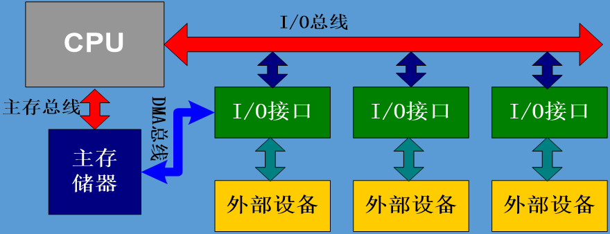
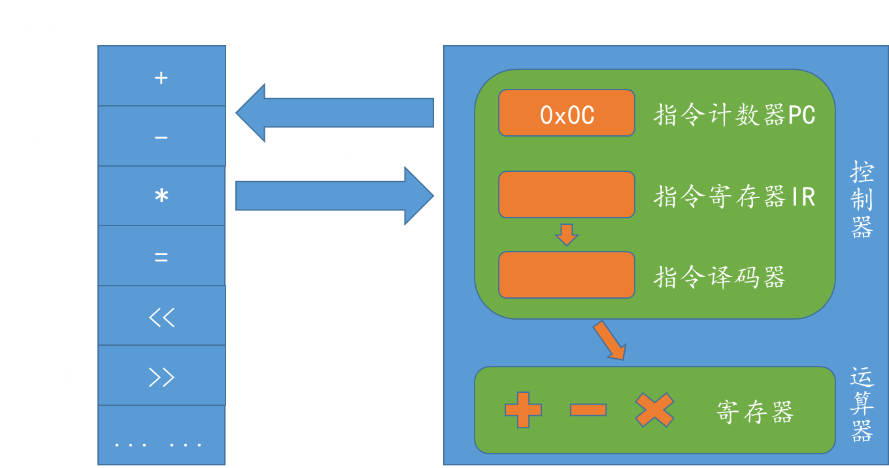
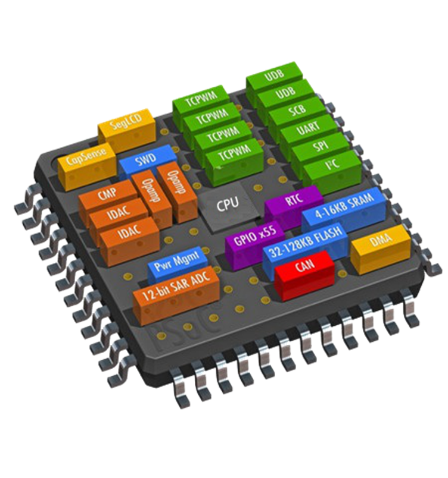
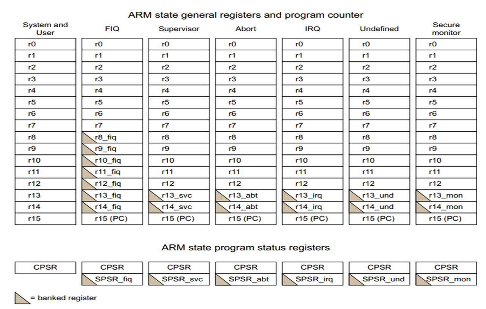
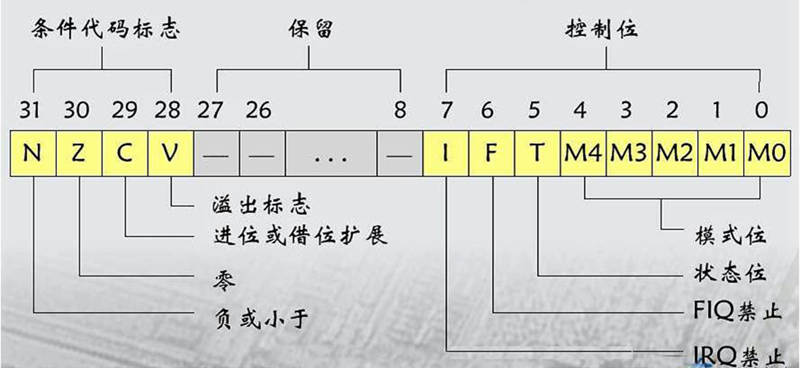
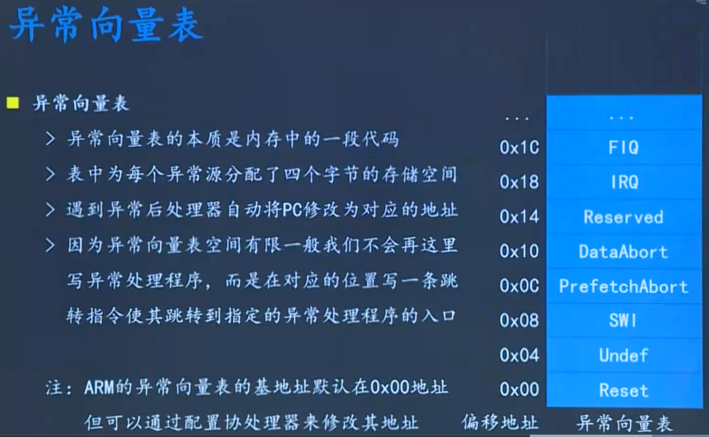
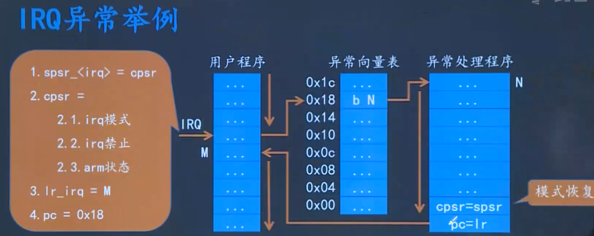

# 计算机基础知识

## 1.冯诺依曼和哈佛结构

1. 存储器结构
   - **冯诺依曼结构**
     将程序指令存储器和数据存储器合并在一起，指令和数据存储在同一个存储器中，使用相同的地址空间。这种结构下，CPU在执行指令时需要从存储器中取出指令和数据，且指令和数据共享同一总线进行传输。
   - **哈佛结构**
     使用两个独立的存储器模块，分别存储指令和数据，每个存储器有独立的地址空间。这种结构下，指令和数据使用不同的总线进行传输，从而提高了数据传输的效率和并行性。
2. 数据传输方式
   - **冯诺依曼结构**
     指令和数据共享同一总线，数据传输时可能存在冲突，影响执行效率。
   - **哈佛结构**
     指令和数据使用不同的总线进行传输，可以并行读取指令和数据，提高了执行效率。
3. 执行效率
   - **冯诺依曼结构**
     由于指令和数据共享同一存储空间，且通过同一总线传输，可能导致在执行过程中存在取指和取数的冲突，从而影响执行效率。
   - **哈佛结构**
     由于指令和数据分别存储在独立的存储器中，并通过不同的总线传输，可以并行处理指令和数据，从而提高了执行效率。
4. 灵活性
   - **冯诺依曼结构**
     由于指令和数据共享存储空间，可以更灵活地修改和更新程序。
   - **哈佛结构**
     由于指令和数据分别存储在独立的存储器中，修改程序时需要分别修改指令和数据存储器，相对不太灵活。

## 2.两种结构的联系

1. **共同目标**
   两者都是计算机体系结构的组织方式，旨在提高计算机的执行效率和性能。
2. **历史背景**
   冯诺依曼结构和哈佛结构都可以追溯到计算机发展的早期阶段，并对后续的计算机体系结构设计产生了深远的影响。
3. **实际应用**
   在现代计算机系统中，冯诺依曼结构和哈佛结构都有其应用场景。
   例如：冯诺依曼结构广泛应用于桌面端计算机（如X86架构），而哈佛结构则在移动领域（如ARM架构）占据重要地位。

综上所述，冯诺依曼结构和哈佛结构在存储器结构、数据传输方式、执行效率和灵活性等方面存在显著差异。然而，它们都是计算机体系结构中重要的组织方式，各自在特定的应用场景下具有独特的优势和价值。

## 3.总线介绍

总线是计算机中各个部件之间传送信息的公共通信干线,，在物理上就是一束导线。

按照其传递信息的类型可以分为**数据总线**、**地址总线**、**控制总线**、**DMA总线**（直接访问存储器，不需要经过CPU）。


## 4.多级存储结构与地址空间

### 1.三级存储结构

1. Cache、主存储器（按字节，断电丢失）、辅助存储器（按块）。

2. CPU能直接读写cache和主存储器，但不能直接访问辅助存储器。

### 2.地址空间

虽然主存储器空间够大，但并不意味着CPU也能读这么大的内存。

主要还是看地址总线有几根，才能决定CPU的访存空间有多大，这部分能读的空间叫做CPU的地址空间或者寻址空间。

一个处理器能够访问（读写）的存储空间是有限的，我们称这个空间为它的地址空间（寻址空间）,一般来说N位地址总线的处理器的地址空间是2的N次方。

## 5.CPU工作原理概述



- 每执行一条指令后PC的值会自动增加指向下一条指令。

- 一条指令的执行分为三个阶段

  1.**取址**

   CPU将PC寄存器中的地址发送给内存，内存将其地址中对应的指令返回到CPU中的指令寄存器（IR）。

  2.**译码**

   译码器对IR中的指令进行识别，将指令（机器码）解析成具体的运算。

  3.**执行**

   控制器控制运算器中对应的运算单元进行运算，运算结果写入寄存器。


# 嵌入式系统分层

- **操作系统的作用**
  向下管理硬件，向上提供接口(API)
  
- **应用开发**
  即使用系统提供的接口（API）,做上层应用程序的开发
  
- **底层开发**
  即做操作系统本身的开发，即实现系统提供给上层的接口
  
- **Linux层次结构**
  进程管理，内存管理，文件系统，**设备管理**，网络协议
  
- **Linux子系统**
    1.进程管理（内核内部实现）：管理进程的创建、调度、销毁等

    2.内存管理（内核内部实现）：管理内存的申请、释放、映射等

    3.文件系统（内核内部实现）：管理和访问磁盘中的文件

    4**.设备管理（我们自己实现）：硬件设备及驱动的管理**

    5.网络协议（内核内部实现）：通过网络协议栈(TCP、IP...)进行通信

# ARM体系结构与接口技术

## 1.SOC

SOC即片上系统，就是一块板子 = CPU + 外围硬件电路（外设，一堆寄存器的集合）


## 2.ARM体系结构

主要是介绍CPU的工作原理等，包括：存储模型，工作模式，寄存器，异常机制，流水线，（汇编）指令集。

## 3.接口技术

主要介绍CPU如何控制外围硬件，对硬件的控制比如：GPIO，PWM，UART，ADC，RTC，IIC等。


------

# ARM体系结构理论基础

ARM，x86指的是处理器。CortexA8，A9指的是指令集架构，简称架构，架构不一样，指令集也不一样。

## 1.ARM处理器概述

- **RISC处理器**
  主要有ARM处理器，RISC翻译为reduced精简指令集。
  RISC只保留常用的简单指令，硬件结构简单，复杂操作一般通过简单指令的组合实现，一般指令长度固定，且多为单周期指令。
  RISC处理器在功耗，体积，价格等方面有很大优势，所以在嵌入式移动终端领域应用极为广泛。
- **CISC处理器**
  
     主要有X86处理器，CISC翻译为complex复杂指令集。
     CISC不仅包含了常用指令，还包含了很多不常用的特殊指令，硬件结构复杂，指令条数较多，一般指令长度和周期都不固定。
     
     CISC处理器在性能上有很多优势，多用于PC及服务器等领域。

## 2.ARM指令集概述

- **指令**
  能够被CPU直接认识且能够执行的以机器码的方式存在的命令称为指令。
  一条指令对应一条汇编。
  
- **指令集**
     处理器能识别的指令的集合称为指令集。
     不同架构的处理器指令集不同。
     指令集是处理器为开发者提供的接口，比如：ADD，SUB，MUL等。
  
- **ARM指令集（ARM支持）**
  所有指令都占用32bit存储空间。代码灵活度高，简化了解码复杂度，执行ARM指令集时PC每次自增4。
  
- **Thumb指令集（ARM支持）**
  所有指令都占16bit存储空间。代码密度高，节省存储空间。每次执行完指令PC自增2。
  
- **编译原理**
  机器码（不可移植）----> 汇编语言（不可移植）---- >高级语言（可移植）。
  
-  **不可移植**

     机器码0101在ARM表示加，但在X86里面加是1100，同理在X86里面有乘MUL，但在ARM里面没有乘法MUL。

  **`gcc`**：把高级语言编译成X86指令。

  **`arm-gcc`**：把高级语言编译成ARM指令。

------

# ARM的存储模型

## 1.ARM数据存储

- **数据类型**
  采用32位架的构ARM，有以下三种数据类型：
  
  ```asm
  Byte			8bits
  Halfowrd	     16bits
  Word		    32bits
  ```
- **数据对齐**
  
  - **word**型数据在内存的**起始地址**必须是**4的整数倍**。
  - **Halfword**型数据在内存的**起始地址**必须是**2的整数倍**。
- **大小端模式**
  ARM一般使用小端模式。

## 2.ARM指令存储

- **处理器处于ARM状态时**
	- 所有指令在内存的起始地址必须是4的整数倍。
	- PC的值由 [31:2]位决定，[1:0]未定义，由于4的倍数的最低2位一定是0。
	- 当为PC的值自定义时，如果给的值不是4的倍数，翻译成机器码后会被强制转为4的倍数。
- **处理器处于Thumb状态时**
    - 所有指令在内存的起始地址必须是2的整数倍。
    - PC的值由 [31:1]位决定，[0]未定义，由于2的倍数的最低1位一定是0。

------

# Cortex-A工作模式

## 1.模式的介绍

- **User用户模式**
  是**非特权模式**，一般在执行上层的应用程序时ARM处于该模式。操作系统的内核态和用户态与此处处理器的用户模式不是一个概念，一个针对操作系统，一个针对CPU。
  ⽤户模式是⽤户程序的⼯作模式，它运⾏在操作系统的⽤户态，它没有权限去操作其它硬件资源，只能执⾏处理⾃⼰的数据，也不能切换到其它模式下，要想访问硬件资源或切换到其它模式只能通过软中断或产⽣异常。
- **FIQ快速中断模式**
  快速中断模式是相对⼀般中断模式⽽⾔的，它是⽤来处理对时间要求比较紧急的中断请求，主要⽤于⾼速数据传输及通道处理中。
  快速中断有许多（R8~R14）⾃⼰的专⽤寄存器，发⽣中断时，使⽤⾃⼰的寄存器就避免了保存和恢复某些寄存器。
  如果异常中断处理程序中使⽤它⾃⼰的物理寄存器之外的其他寄存器，异常中断处理程序必须保存和恢复这些寄存器。
- **IRQ一般中断模式**
  ⼀般中断模式也叫普通中断模式，是低优先级中断，⽤于处理⼀般的中断请求，通常在硬件产⽣中断信号之后⾃动进入该模式，该模式为特权模式，可以⾃由访问系统硬件资源。
- **SVC复位或者软中断**
  管理模式是CPU上电后默认模式，因此，在该模式下主要⽤来做系统的初始化。
  软中断处理也在该模式下。当⽤户模式下的⽤户程序请求使⽤硬件资源时，通过软件中断进入该模式。
- **Abort终止模式**
  中⽌模式⽤于⽀持虚拟内存或存储器保护，当⽤户程序访问非法地址，没有权限读取的内存地址时，会进入该模式。
  Linux下编程时经常出现的segment fault通常都是在该模式下抛出返回的。
- **UNDEF未定义模式**
  未定义模式⽤于⽀持硬件协处理器的软件仿真，CPU在指令的译码阶段不能识别该指令操作时，会进入未定义模式。
- **SYS系统模式**
  系统模式是**特权模式**，不受⽤户模式的限制。
  ⽤户模式和系统模式共⽤⼀套寄存器，操作系统在该模式下可以⽅便的访问⽤户模式的寄存器，⽽且操作系统的⼀些特权任务可以使⽤这个模式访问⼀些受控的资源。
  ⽤户模式与系统模式两者使⽤相同的寄存器，都没有SPSR（Saved Program Statement Register，已保存程序状态寄存器），但系统模式比⽤户模式有更⾼的权限，可以访问所有系统资源。
- **monitor**
  为了安全而扩展出的用于执行安全监控代码的模式。

## 2.模式的总结

- **不同模式拥有不同权限**
  - 用户模式权限最低，以此保护系统安全。所谓特权模式，即具有如下权利： 
  	a. MRS（把状态寄存器的内容放到通⽤寄存器） 
  	b. MSR（把通⽤寄存器的内容放到状态寄存器中）。
  - 由于状态寄存器中的内容不能够改变，因此，要先把内容复制到通⽤寄存器中，然后修改通⽤寄存器中的内容，再把通⽤寄存器中的内容复制给状态寄存器中，即可完成“修改状态寄存器”的任务。
- **不同模式执行不同代码**
  如刚启动时进入SVC执行一些初始化代码
- 不同模式实现不同功能

- 不同模式使用不同寄存器

## 3.模式的分类

- **按照权限分**
  `user`未非特权模式，其余全为特权模式。
- **按照状态分**
  `FIQ , IRQ, SVC, Abort，Undef`属于异常模式.

------

# Cortex-A内核寄存器

## 1.寄存器介绍

- 内核寄存器是处理器内部的存储器，没有地址，所存的数据只能是整型，不能是浮点型，且只能是局部数据，不允许全局数据。

- 在某个特定模式下只能使用当前模式下的寄存器，一个模式下特有的寄存器其他模式下不能使用。

- 一般用于暂时存放参与运算的数据和运算结果。

- 包括**通用寄存器**，**专用寄存器**（PC，IR），**控制寄存器**。




带三角形的表示该模式下特有的寄存器，是新的一个，如`r13_fiq`,`r13_svc`和`r13`是三个不一样的寄存器**。数一下一共有40个寄存器**。

## 2.寄存器分类

### 1.通用寄存器

`r0~r14` + `r8_fiq~r14_fiq`+`r13_svc~r14_svc` +... + .... = 32个通用寄存器。

- **R14**(LR,Link Register）

  执行跳转指令(BL/BLX)时，LR会**自动**保存跳转指令下一条指令的地址，程序需要返回到发生跳转的那个地方时将LR值复制到PC即可实现。（主动情况）

  产生异常时，相当于异常中断处理，处理完后自动返回原先的位置继续往下执行程序。（被动情况）

- **R13**(SP,Stack Pointer)
  栈指针，用于存储当前模式下栈的**栈顶**地址。
  栈的本质就是一段内存空间，存的是一些临时数据比如局部变量，函数参数，函数返回值等。

### 2.专用寄存器

- **R15**(PC，program counter)

  程序计数器，存储当前取址指令的地址，可以自动增加4修改，也可以手动人为修改。

- **CPSR**
  固定用作控制寄存器，是**当前程序状态寄存器**。

### 3.程序状态寄存器



- **Bit[0:4]模式位**
  表示八种不同的工作模式，其中：

  ```asm
  [10000] @user模式
  
  [10001] @FIQ模式
  
  [10010] @IRQ模式
  ```

- **Bit[5]状态位**
  两种工作状态：

  ```asm
  [0]	@ARM状态
  
  [1] @Thumb状态
  ```

- **Bit[6]**

  ```asm
  FIQ
  @[0]开启
  @[1]禁止
  ```

- **Bit[7]**

  ```asm
  IRQ
  @[0]开启
  @[1]禁止	
  ```

  > [!CAUTION]
  >
  > svc模式初始化时，FIQ，IRQ一定是关闭状态。

- **Bit[31:28]**

  ```asm
  NZCV
  
  @31位：结果为负数时，此位自动置1，否则为0
  
  @30位：结果产生0，此为自动置1，否则位0
  
  @29位：加法产生进位时自动置1，否则置0；减法借位时自动置0,否则为1
  
  @28位：产生符号位进位和借位，针对于有符号数。若符号位后面的数值位相加太大的产生进位或相减不够减时产生的借位把符号位给变了。
  ```

------

# Cortex-A异常处理

## 1.异常概念

​	处理器在正常执行程序的过程中可能会遇到一些不正常的事件发生，这时处理器就要将当前的程序暂停下来转而去处理这个异常的事件，异常事件处理完成之后再返回到被异常打断的点继续执行程序，需要注意的是异常不是错误。


## 2.异常处理机制

不同处理器对异常的处理流程大体相似，但是不同的处理器在具体实现的机制上有所不同，比如：

1. 处理器遇到哪些事件才认为该事件是异常事件
2. 遇到异常事件之后处理器有哪些动作
3. 处理器如何跳转到异常处理程序
4. 异常处理程序如何处理异常等

上述的这些**细节**的实现称为处理器的异常处理机制。

## 3.异常源

导致异常产生的事件称为异常源，ARM异常源有：

- **FIQ**
  快速中断请求
- **IRQ**
  外部中断请求
- **Reset**
  复位中断
- **SWI**
  软中断
- **data abort**
  数据终止异常，比如：遇到地址不对，或所给地址没权限访问等。
- **prefetch abort**
  指令预取终止，比如：遇到地址不对，或所给地址没有指令。
- **undefined instruction**
  遇到不能识别不能处理的指令。

## 4.异常模式

ARM遇到异常后会切换到对应的异常模式：

- **FIQ模式**
  异常源：FIQ
- **IRQ模式**
  异常源：IRQ
- **SVC模式**
  异常源：`reset`和`swi`
- **Abort模式**
  异常源：`data abort和`prefetch abort`
- **`Undef`模式**
  异常源:`undefined instruction`

## 5.异常后的动作（自动）

1. 拷贝CPSR中的内容到对应异常模式下的SPSR\_<异常模式名>。
2. 修改CPSR的值。
   - 修改中断禁止位，禁止同级或者低级的中断再来打断，但可以被高级中断再次打断。
   - 修改模式位进入对应的异常模式
   - 修改状态位进入ARM状态。
3. 保存返回地址到对应异常模式下的LR\_<模式名>。
4. 设置PC为相应的异常向量(异常向量表对应的地址)，改了PC就可以跳转

## 6.异常返回地址（自编）

下列操作是写在异常处理程序中的：

1. 将SPSR\_<模式名>的值复制给CPSR使处理器恢复之前的状态。
2. 将LR\_<模式名>的值复制给PC。使程序跳转回被打断的地址继续执行。

## 7.异常优先级

多个异常同时产生时的服务顺序，优先级从上往下依次递减

```txt
Reset				   |
Data Abort			    |
FIQ					   |
IRQ					   |
Prefetch Abort		    |
Software Interrupt   	|
Undefined instruction	V
```

## 8.IRQ异常举例



## 9.FIQ和IRQ

**FIQ的响应速度比IRQ快**，原因如下：

1. **FIQ在异常向量表位于最末**
   可直接把异常处理写在异常向量表之后，省去跳转。
2. **FIQ模式有5个私有寄存器(R8-R12)**
   执行中断处理程序前无需压栈保存寄存器，可直接处理中断。
3. **FIQ的优先级高于IRQ**
   - 两个中断同时发生时先响应FIQ。
   - FIQ可以打断RIQ，但IRQ不能打断FIQ。

# ARM指令流水线

## 1.指令流水线

 取址-译码-执行三个步骤形成流水线，虽然流水线级数越来越多，但**都是在三级流水线上进行了细分而已**。

## 2.PC的作用

不管几级流水线，PC指向的永远是当前正在取指的指令，而正在执行的指令的地址为PC-8。

## 3.局限性

指令流水线机制的引入确实能够大大的提升指令执行的速度，但在实际执行程序的过程中很多情况下流水线时是无法形成的。比如：

芯片刚上电的前两个周期、执行跳转指令后的两个周期等。所以指令流水线的引入以及优化只能使平均指令周期不断的接近1而不可能真正的达到1，且流水线级数越多芯片设计的复杂程度就越高，芯片的功耗就越高。

# ARM协处理器

[ARM体系架构—ARMv7-A协处理器-电子工程世界](https://news.eeworld.com.cn/mcu/ic548616.html)
