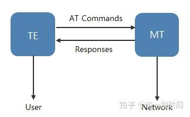
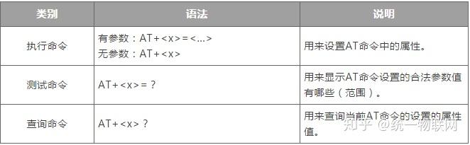

# AT指令概念

AT 指令，全称 **Attention Command**，是一种标准的控制通信模组的命令集。是用来控制TE（TerminalEquipment）和MT(Mobile Terminal)之间交互的规则，如下图所示。在GSM网络中，用户可以通过AT命令进行呼叫、短信、电话本、数据业务、传真等方面的控制。

在 MCU 场景中，常见支持 AT 指令的模组有：

- GSM 模组：如 SIM800、SIM7600，用于打电话、发短信、联网。

- Wi-Fi 模组：如 ESP8266、ESP32，用于连接 Wi-Fi、HTTP/MQTT 通信。

- 蓝牙模组：如 HC-05、JDY 系列。

- GPS 模组：如 NEO-6M，用于定位。

# AT 指令格式与分类

AT命令是以**AT作首，字符结束的字符串，AT命令的响应数据包在其中**。每个命令执行成功与否都有相应的返回。AT指令集可分为三个类型：



举例：

```shell
tx：AT+IPR=115200 #设置模组波特率为 115200 -----执行命令
rx:OK
#=========================================================
tx:AT+IPR=100 #模组波特率设为 100 不允许，出错-----执行命令
rx:ERROR
#=========================================================
tx:AT+IPR? #查询模组当前波特率---------查询命令
rx:+IPR: 115200
rx:OK
#=========================================================
tx:AT+IPR=?#查询模组当前波特率---------测试命令
rx:+IPR: 0, 300, 600, 1200, 2400, 4800, 9600, 19200, 38400,
57600, 115200, 230400, 460800, 921600
rx:OK
```

# AT 命令格式说明

## 1.定义

- ⚫ <CR>: 确认符
- ⚫ <LF>: 换行符
- ⚫ <..>: 参数名称，尖括号不体现在命令行中
- ⚫ [..]: 可选参数，方括号不体现在命令行中
- ⚫  : 空格符

## 2.语法说明

### 1.前置字符说明

采用”AT”或”at”标识当作命令的前置字符， 模组仅识别该类字符当作 AT 命令。

### 2.命令字段

标准命令，符合 3GPP 27007、 27005 以及 ITU-T Recommendation V.250 等相关标准约束。
扩展命令， Neoway 自定义

### 3.连接符说明

采用”+”与”$”作为置字符与命令字段的连接符号，具体详情各命令说明

### 4.结束符

默认采用<CR>作为命令行的确认字符，即 0x0D

### 5.命令响应语法

<CR><LF>response<CR><LF>作为部分命令的响应，其中 response 可以是一条内容，也可以
是多条内容，具体示命令而定。

### 6.命令结果语法

默认采用<CR><LF>OK<CR><LF>表示命令执行正常， <CR><LF>ERROR<CR><LF>表示命令执
行失败。根据 AT+CMEE 命令的设置不同，命令结果返回的错误码类型不同,具体参考网上资料。