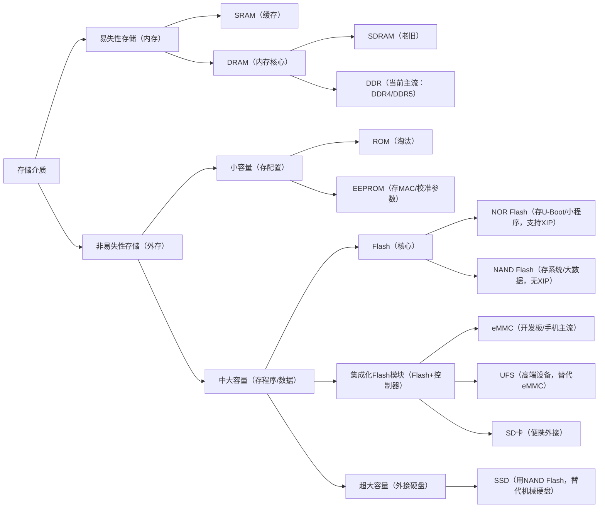

# 基本概念

## 1.存储器的层次结构


> [!CAUTION]
>
> 1. 有的教材把安装在电脑内部的磁盘称为“辅存”，把U盘、光盘等称为“外存”。也有的教材把磁盘、U盘、光盘等统称为“辅存”或“外存”。
> 2. 辅存中的数据要调入主存后才能被CPU访问，主存——辅存层的数据交换由硬件+操作系统完成，实现了虚拟存储系统，解决了主存容量不够的问题。
> 3. Cache——主存：由硬件自动完成，解决主存与CPU容量不匹配的问题。

## 2.存储器分类

- **按层次分类**
  见第一章节第一部分
- **按存储介质**
  半导体（主存，Cache），磁性材料存储器（磁盘，磁带），光存储器（光盘）
- **按存取方式**
  随机存取存储器（RAM），顺序存储器(SAM)如磁带，直接存取存储器（DAM）如机械硬盘，相联存储器，按内容访问的存储器（CAM）如快表。
- **按信息的可更改性**
  读写存储器，只读存储器（ROM）。
- **按信息的可保存性****
  易失性存储器，非易失性；破坏性读出，非破坏性读出。

## 3.存储器性能指标

1. **存储容量**

   指主存可以存储的二进制代码的总位数，即存储容量=存储单元个数 * 存储字长，计算出的存储容量的单位为位（容量也可以使用字节总数来表示，即存储单元个数*存储字长/8，计算出的存储容量的单位为MB，GB，TB等单位）对于一个存储芯片而言，容量是以位为单位描述的（比如4K x 8位）；对于一个微机系统而言，容量是以字节为单位描述的（比如1MB）。

2. **单位成本**：每位价格=总成本/总容量

3. **存储速度**
   存储速度是由存取时间和存取周期来表示的。数据传输率=数据的宽度/存储周期。
   读出时间：从存储器接收有效地址开始，到产生有效输出所需的全部时间

   写入时间：从存储器接收到有效地址开始，到数据写入被选中单元为止所需要的全部时间

# 半导体存储芯片

半导体存储芯片采用超大规模集成电路制造工艺，在一个芯片内部集成具有记忆功能的存储矩阵、译码驱动电路和读/写电路等（与存储器相关的MAR和MDR制作在了CPU中）

## 4.`RAM`

### 1.`DRAM`（动态随机存取存储器）

**特点**：

- **大容量**：能够存储大量数据，适合构建大容量内存系统。
- **易失性**：断电后数据会丢失，需要定期刷新电路以保持数据稳定。
- **相对较低的成本**：制造工艺相对简单，成本较低。

**应用场景**：

- 计算机系统的主存储器，用于存储正在运行的程序和数据。
- 图形处理、视频编辑等需要高速数据处理的应用场景。

### 2.`SRAM`（静态随机存取存储器）

**特点**：

- **高速访问**：存取速度非常快，接近CPU的处理速度。
- **低功耗**：不需要周期性刷新电路，功耗较低。
- **较高的成本**：制造工艺复杂，成本高于DRAM。

**应用场景**：

- CPU和`GPU`的高速缓存，提高数据处理速度。
- 寄存器文件，存储临时数据和指令。
- 需要高速数据访问的嵌入式系统和通信设备。

### 3.`SRAM`和`DRAM`对比


## 5.`ROM`

### 1.`ROM`（基础）

**特点**：

- **非易失性**：断电后数据不会丢失。
- **数据不可更改**（除衍生类型外）：出厂时数据已被写入，用户无法更改。

**应用场景**：

- **存储固件、启动代码和其他永久性数据。**
- 嵌入式系统中的引导程序和关键程序。

### 2.`PROM`（可编程只读存储器）

**特点**：

- 数据通过特殊设备一次性写入，之后不能更改。

**应用场景**：

- 早期计算机系统和电子设备的固件存储。

### 3.`EPROM`（可擦除可编程只读存储器）

**特点**：

- 可通过紫外线照射擦除数据，并通过编程器重新写入。
- 擦除和重新编程过程较为繁琐。

**应用场景**：

- 需要更新固件的电子设备，如旧式路由器和交换机。

### 4.`EEPROM`（电可擦除可编程只读存储器）

**特点**：

- 使用电信号来擦除和重新写入数据，方便快捷。
- 擦写次数多，可靠性高。

**应用场景**：

- 频繁更改数据的场合，如电子设备的配置参数存储。
- 智能手机、平板电脑等消费电子产品的固件更新。

## 6.`Flash`存储器

### 1.`NOR Flash`

**特点**：

- 较快的读取速度和较高的随机访问性能。
- 写入和擦除速度较慢，容量相对较小。

**应用场景**：

- 嵌入式系统的引导存储器，**存储操作系统的代码和引导程序**。
- 需要快速执行代码的小容量存储设备，如智能卡和安全芯片。

### 2.`NAND Flash`

**特点**：

- 较高的存储密度和较快的写入/擦除速度。
- 随机访问性能较低，但适合大容量数据存储。

**应用场景**：

- USB闪存驱动器、存储卡和固态硬盘（SSD）等存储设备。
- 移动设备、数据中心和云计算环境中的大容量数据存储。

# RAM 内部结构详解

## 1.术语谱系

`RAM` 是“随机存取存储器”的总称，按存储单元的实现方式分为 `SRAM` 与 `DRAM` 两大类；`DRAM` 接口演进为 `SDRAM`，`SDRAM` 进一步演进为 `DDR SDRAM`。谱系如下：

```txt
RAM（随机存取存储器，总称）
├── SRAM  静态 RAM——触发器存储，无需刷新
└── DRAM  动态 RAM——电容存储，需刷新
    └── SDRAM  同步 DRAM——加时钟，命令同步
        └── DDR SDRAM  双倍数据速率
            └── DDR2 / DDR3 / DDR4 / DDR5（代数）
```

- **RAM**（Random Access Memory）：任意地址的读写时间接近，不挑顺序（反义为顺序存储器，如磁带）。
- **SRAM**：每 bit 用 6 个晶体管（锁存器）存储，数据不掉，无需刷新，速度快、成本高、密度低，用于 CPU 缓存与寄存器。
- **DRAM**：每 bit 用 1 个晶体管 + 1 个电容存储，电容漏电需周期刷新，速度较慢、成本低、密度高，用于主存。
- **SDRAM**（Synchronous DRAM）：给 DRAM 增加时钟，读写命令与时钟边沿同步，支持流水线与高频。
- **DDR**（Double Data Rate SDRAM）：时钟上升沿与下降沿都传输数据，一个时钟周期传两次。DDR2/3/4/5 为代数，预取位宽逐代翻倍。

## 2.从 DDR 内存条逐步拆解

以一条 DDR 内存条为例，从外到内逐层拆解：

### 1.DIMM（内存条整体）

一条 DDR 内存条即一个 **DIMM**（Dual In-line Memory Module，双列直插内存模块），由 PCB 板、若干 DRAM 颗粒、SPD 芯片（存时序参数）与金手指组成；DDR5 另含一颗 PMIC（电源管理芯片）。按是否带缓冲细分 UDIMM（无缓冲）、RDIMM（寄存）、SO-DIMM（笔记本）。

### 2.Rank（内存条上的分组）

一个 **rank** 是一组颗粒并行凑满数据总线位宽（64 bit 非 ECC / 72 bit ECC）的组合。一条内存条可含 1/2/4 个 rank，多个 rank 共用同一条总线，但同一时刻只有一个 rank 工作。

### 3.Chip（DRAM 颗粒）

单颗 DRAM 芯片按数据位宽分为 x4 / x8 / x16。以 x8 颗粒为例，每颗贡献 8 bit 数据，因此 64 bit 总线需要 **8 颗 x8 颗粒凑成一个 rank**（x4 需 16 颗，x16 只需 4 颗）。

### 4.Bank（颗粒内部的阵列分组）

一颗 chip 内部又划分为多个 **bank**，每个 bank 是一块独立的行 × 列存储阵列，可并行访问（一个 bank 忙时访问另一个 bank）。DDR4 为 16 bank（4 组 × 4），DDR5 为 32 bank（8 组 × 4）。

### 5.Row / Column（bank 内的寻址）

一个 bank 内是二维 cell 阵列。访问流程为：先激活（ACT）某一行，把整行读入 row buffer（sense amplifier），再按列读写，换行前需关闭当前行。

### 6.Cell（最小存储单元）

最小单元为 **1T1C**：1 个晶体管（开关）+ 1 个电容（存电荷）。电容有电荷记为 1，无电荷记为 0；因电容漏电，需周期刷新。

## 3.bank / rank / channel 对比

| 概念    | 层级           | 含义                            | 并行方式     |
| ------- | -------------- | ------------------------------- | ------------ |
| channel | 主板 ↔ 内存条  | CPU 的内存通道，一个控制器可含多通道 | 各通道独立   |
| rank    | 内存条层面     | 一组颗粒凑满 64/72 bit 位宽      | 分时共用总线 |
| chip    | 颗粒           | 单颗 DRAM 芯片（x4/x8/x16）      | —            |
| bank    | 颗粒内部       | 行 × 列存储阵列分组             | 行间并行     |

一句话区分：**rank 是“内存条上分几组颗粒”，bank 是“颗粒内部分几个阵列”**，两者层次完全不同。

# 存储介质总框架

##  1.两大核心分类

所有存储介质，本质都是 “存数据的容器”，但最根本的区别是 **“断电后数据会不会丢”** —— 这直接决定了它们的用途（是 “临时工作台” 还是 “长期仓库”）。

| 分类                 | 核心特点（易失性） | 核心用途                       | 通俗类比                                                     |
| -------------------- | ------------------ | ------------------------------ | ------------------------------------------------------------ |
| 易失性存储（内存）   | 断电后数据立即丢失 | 临时存 “正在运行的程序 / 数据” | 办公的**工作台**：放正在处理的文件，下班（断电）就清空       |
| 非易失性存储（外存） | 断电后数据长期保留 | 长期存 “程序 / 静态数据”       | 家里的**衣柜 / 仓库**：放不常用的衣服 / 物品，关门（断电）也还在 |

## 2.每个介质的概念、特点、场景

下面按 “易失性→非易失性” 的顺序，逐个讲清每个介质，包括提到的 **RAM、SDRAM、DDR、ROM、Flash、EEPROM、eMMC、SSD**等。

### 1.易失性存储（内存）

这类存储**速度极快**（跟 CPU 速度匹配），但**容量小、成本高**，只能临时用，核心是 “支撑程序运行”。

| 介质         | 概念与特点                                                   | 速度对比               | 通俗例子                                       | 开发场景应用（Linux 开发板 / 单片机）                        |
| ------------ | ------------------------------------------------------------ | ---------------------- | ---------------------------------------------- | ------------------------------------------------------------ |
| **SRAM**     | 静态随机存取存储器（Static RAM）：无需刷新电路，速度最快，但成本极高、容量小 | 最快（纳秒级）         | CPU 的**L1/L2/L3 缓存**                        | 1. 单片机内部：比如 STM32 的 “内部 SRAM”（几 KB~ 几十 KB），程序运行时临时存变量；<br /> 2. Linux 开发板：CPU 内置的缓存，加速数据读取（用户看不到，硬件自动用）。 |
| **DRAM**     | 动态随机存取存储器（Dynamic RAM）：需定时刷新（耗电），速度比 SRAM 慢，成本低、容量大 | 比 SRAM 慢（几十纳秒） | 电脑的 “内存” 原型                             | 所有需要大容量临时存储的场景，是 “内存” 的核心类型，下面的 SDRAM、DDR 都是它的升级款。 |
| ├─ **SDRAM** | 同步动态 RAM（Synchronous DRAM）：与 CPU 时钟同步，比早期 DRAM 快，是 DDR 的前身 | 比 DRAM 快             | 早期电脑 / 开发板的内存                        | 老旧 Linux 开发板（如 2010 年前的 ARM9 板），现在基本被 DDR 取代。 |
| └─ **DDR**   | 双倍数据速率 SDRAM（Double Data Rate SDRAM）：在 SDRAM 基础上翻倍带宽，是当前主流 | 比 SDRAM 快 2 倍 +     | 现在电脑的 “DDR4/DDR5 内存”、手机的 “运行内存” | 1. Linux 开发板：核心 “内存”（比如 RK3568 板的 2GB DDR4），启动时 U-Boot 把 Linux 内核加载到 DDR 中运行，应用程序的临时数据也存在这里； <br />2. 单片机：高端单片机（如 STM32H7）也支持外接 DDR，跑复杂程序。 |

### 2.非易失性存储（外存）

这类存储**速度慢**（比内存慢 100~1000 倍），但**容量大、成本低、断电存数据**，核心是 “长期保存程序和静态数据”。按 “容量 + 擦写方式” 再细分：

#### 1. 小容量非易失性存储（存配置 / 小程序）

| 介质       | 概念与特点                                                   | 容量范围        | 擦写方式   | 通俗例子                             | 开发场景应用                                                 |
| ---------- | ------------------------------------------------------------ | --------------- | ---------- | ------------------------------------ | ------------------------------------------------------------ |
| **ROM**    | 只读存储器（Read-Only Memory）：出厂时一次性写入，之后只能读，不能改 | 几 KB~ 几 MB    | 不可擦写   | 早期计算器 / 洗衣机的固化程序        | 几乎淘汰，仅在极老旧设备（如早期 51 单片机）中用，现在被 EEPROM/Flash 取代。 |
| **EEPROM** | 电可擦除 ROM（Electrically Erasable ROM）：电擦写（无需拆芯片），按 “字节” 擦写，速度慢、容量小 | 几十字节～几 KB | 字节级擦写 | 设备的 “身份证”（MAC 地址、设备 ID） | 1. 单片机：存硬件配置（如 STM32 的 I2C EEPROM，存校准参数）；<br /> 2. Linux 开发板：存网卡 MAC 地址、BIOS 配置（部分老板）。 |

#### 2. 中大容量非易失性存储（存程序 / 系统 / 大数据）—— 核心是 “Flash”

Flash（闪存）是当前主流，按 “存储结构” 分 **NOR Flash** 和 **NAND Flash**，两者是 “兄弟” 但用途完全不同，是开发板 / 单片机的核心存储！

| 介质           | 概念与特点                                                   | 容量范围       | 擦写方式   | 关键能力               | 通俗例子                              | 开发场景应用（核心重点）                                     |
| -------------- | ------------------------------------------------------------ | -------------- | ---------- | ---------------------- | ------------------------------------- | ------------------------------------------------------------ |
| **NOR Flash**  | 按 “页” 读、按 “扇区” 擦写，**支持 XIP（原地执行）**（CPU 直接读 Flash 运行程序），速度快（读）、成本高 | 几 MB~ 几百 MB | 扇区级擦写 | 支持 XIP（核心优势）   | 手机早期的 “系统分区”、U 盘（小容量） | 1. 存 “启动程序”：Linux 开发板的**U-Boot**（比如 2MB NOR Flash，开机先运行 U-Boot，不用加载到 RAM）；<br /> 2. 单片机：存小程序（如 STM32 的 “内部 NOR Flash”，几 MB 容量，程序直接在 Flash 里运行）。 |
| **NAND Flash** | 按 “块” 擦写，**不支持 XIP**（程序必须加载到 RAM 才能运行），速度慢（读）、容量大、成本低，有 “坏块” 问题（需管理） | 几十 MB~ 几 TB | 块级擦写   | 大容量存储（核心优势） | U 盘（大容量）、SSD 的核心芯片        | 1. Linux 开发板：存 “Linux 内核 + 根文件系统”（比如 16GB NAND Flash，U-Boot 启动后把内核加载到 DDR 中运行）；<br /> 2. 单片机：仅在大容量需求场景（如存日志）中用，需搭配 NOR Flash 存程序。 |

#### 3. 集成化 Flash 模块（把 Flash + 控制器打包，更易用）

上面的 NOR/NAND Flash 是 “裸芯片”，需要额外电路管理（比如坏块、磨损均衡），于是有了 “集成化模块”—— **eMMC、UFS、SD 卡**，**本质是 “Flash 芯片 + 控制器” 的组合，**即 “成品仓库”。

| 介质      | 概念与特点                                                   | 核心组成                  | 速度对比          | 通俗例子                              | 开发场景应用                                                 |
| --------- | ------------------------------------------------------------ | ------------------------- | ----------------- | ------------------------------------- | ------------------------------------------------------------ |
| **eMMC**  | 嵌入式多媒体卡（embedded MultiMediaCard）：把 NAND Flash + 控制器集成在一个芯片里，支持热插拔（少用），是手机 / 开发板主流 | NAND Flash + 控制器       | 中速（几十 MB/s） | 手机的 “存储”（非内存）、平板         | Linux 开发板的核心存储（如 RK3568 板的 32GB eMMC）：直接烧录 U-Boot + 内核 + 根文件系统，无需管 NAND 坏块（控制器自动处理）。 |
| **UFS**   | 通用闪存存储（Universal Flash Storage）：比 eMMC 快（串行总线），支持多任务，是 eMMC 的升级款 | NAND Flash + 高性能控制器 | 高速（几百 MB/s） | 现在手机的 “存储”（如 iPhone 的 UFS） | 高端 Linux 开发板（如 RK3588）、旗舰手机，替代 eMMC，适合跑大型系统（如 Ubuntu）。 |
| **SD 卡** | 安全数字卡（Secure Digital Card）：eMMC 的 “便携版”，可插拔，容量灵活 | 几百 MB~ 几 TB            | -                 | 相机 SD 卡、开发板外接卡              | 1. Linux 开发板：外接存日志、备份镜像； <br />2. 单片机：外接存图片 / 数据（如 ESP32 配 SD 卡模块）。 |

#### 4. 超大容量非易失性存储（外接硬盘）

| 介质    | 概念与特点                                                   | 核心组成                        | 速度对比               | 通俗例子                  | 开发场景应用                                                 |
| ------- | ------------------------------------------------------------ | ------------------------------- | ---------------------- | ------------------------- | ------------------------------------------------------------ |
| **SSD** | 固态硬盘（Solid State Drive）：用多个 NAND Flash + 控制器 + 缓存（SRAM）组成，速度远快于机械硬盘，无机械部件 | 多颗 NAND Flash + 控制器 + 缓存 | 极快（几百 MB/s~GB/s） | 电脑的 SSD 硬盘、移动 SSD | Linux 开发板外接存储（如通过 USB 接 SSD）：存大量数据（如深度学习数据集）、跑大型数据库。 |

# 关系图




# 数据怎么流动

以 **“Linux 开发板启动 + 程序运行”** 和 **“单片机程序下载 + 运行”** 两个场景为例，串起所有介质：

## 1.`Linux` 开发板（如` RK3568`）的完整流程

1. **上电启动**
   CPU 先读 **NOR Flash** 里的 U-Boot（因为 NOR 支持 `XIP`，不用加载到 RAM，直接运行）；
2. **加载系统**
   U-Boot 初始化硬件（包括` DDR`），然后从 **`eMMC`（内部` NAND` Flash）** 中读取 Linux 内核和根文件系统，加载到 **`DDR`（内存）** 中；
3. **运行程序**
   内核启动后，应用层程序（如C 程序）运行时，代码和临时数据存在 **`DDR`** 中；需要长期保存的数据（如日志、配置文件）写入 **`eMMC`**；
4. **外接存储**
   如果需要存大量数据（如视频），通过 `USB` 接 **`SSD`** 或插 **SD 卡**，数据存在这些外接存储中。

## 2.单片机（如 `STM32`）的完整流程

1. **下载程序**
   用编程器把 C 语言编译后的二进制程序，烧录到 `STM32` 内部的 **NOR Flash**（几 MB 容量）；
2. **上电运行**
   单片机上电后，CPU 直接从 **NOR Flash** 读取程序（支持 `XIP`），把程序中的变量加载到内部的 **`SRAM`**（几十 KB）中临时存储；
3. **保存配置**
   如果需要存设备 ID 或校准参数，写入外接的 **`EEPROM`**（几 KB）；如果需要存日志，外接 **SD 卡** 或 **`NAND` Flash**。

# 终极区分方法

1. **第一步：看易失性**
   - 断电丢数据 → 易失性（内存）→ 再看速度：快到纳秒级是 `SRAM`（缓存），几十纳秒是 `DDR/SDRAM`（内存）；
   - 断电存数据 → 非易失性（外存）→ 第二步。
2. **第二步：看容量**
   - 容量＜`1MB` → 小容量：存配置（`EEPROM`）或淘汰的 ROM；
   - 容量≥`1MB` → 中大容量 → 第三步。
3. **第三步：看核心用途**
   - 存启动程序（如 U-Boot）、支持 “直接运行” → NOR Flash；
   - 存系统 / 大数据、需要加载到 RAM 运行 →` NAND Flash/eMMC/UFS`；
   - 便携可插拔 → SD 卡；
   - 外接超大容量 → `SSD`。

# 固体和机械硬盘

- 想**存得多、花得少**（比如海量日志、备份），不怕慢和噪音 —— 选` HDD`机械硬盘；
- 想**读得快、抗造、安静**（比如系统盘、开发板启动、高频读写），能接受稍高成本 —— 选` SSD`固态硬盘。

[计算机组成原理——存储器（Memory）-CSDN博客](https://blog.csdn.net/m0_66881249/article/details/129131854)
