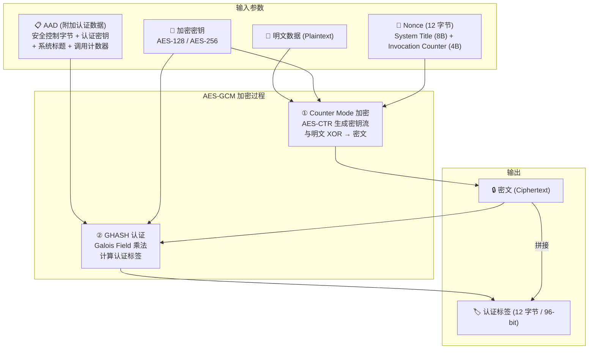
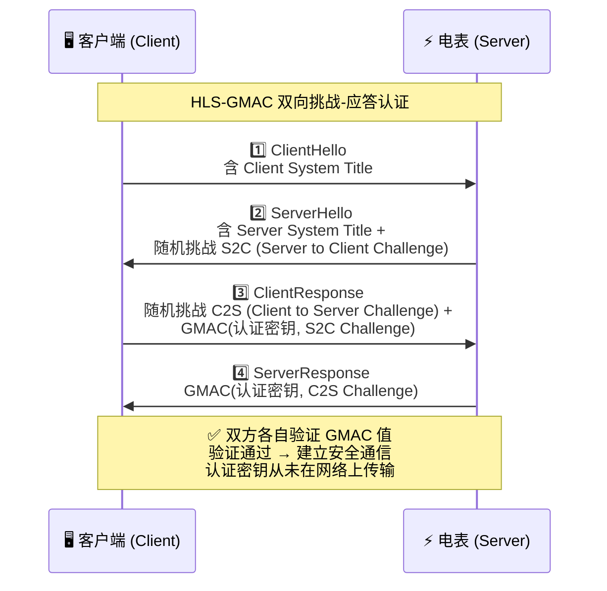

DLMS（Device Language Message Specification）/ COSEM 是 IEC 62056 系列标准定义的智能电表通信协议，广泛应用于电表、水表、气表等计量设备。其安全机制在 IEC 62056-5-3 中定义，覆盖认证、加密、完整性、防重放等多个维度。

# 整体架构

如上图所示，DLMS/COSEM 的安全体系由三大支柱构成：**安全套件**（定义算法组合）、**密钥体系**（管理各类加密密钥）、**安全服务**（提供具体的保护机制）。下面逐一深入分析。

------

# 安全套件

|     特性     |           Suite 0           |     Suite 1      |     Suite 2      |
| :----------: | :-------------------------: | :--------------: | :--------------: |
| **认证加密** |         AES-GCM-128         |   AES-GCM-128    |   AES-GCM-256    |
| **数字签名** |              —              |   ECDSA P-256    |   ECDSA P-384    |
| **密钥协商** |              —              |    ECDH P-256    |    ECDH P-384    |
| **哈希算法** |              —              |     SHA-256      |     SHA-384      |
| **密钥传输** | AES-128 key wrap (RFC 3394) | AES-128 key wrap | AES-256 key wrap |
|   **压缩**   |              —              |       v.44       |       v.44       |
| **密钥长度** |           128-bit           |     128-bit      |     256-bit      |

- **Suite 0**
  纯对称加密，仅使用 AES-GCM-128 + GMAC，是目前部署最广泛的方案（绝大多数 DLMS UA 认证的电表产品支持 Suite 0）
- **Suite 1**
  在 Suite 0 基础上加入非对称密码学（ECDSA/ECDH P-256 + SHA-256），支持端到端保护和前向保密
- **Suite 2**
  最强安全级别，使用 AES-256 + P-384 曲线 + SHA-384，面向高安全需求场景

------

# AES-GCM 加密流程

AES-GCM（Galois/Counter Mode）是 DLMS 加密的核心算法，它同时提供**机密性**（加密）和**完整性**（认证标签）。下面是具体的加密流程：

AES-GCM 的流程清晰地展示了 DLMS 如何实现「一次操作，同时加密 + 认证」。其中几个关键设计点值得注意：

- **Nonce 构造**：`System Title (8B) + Invocation Counter (4B) = 12B`，确保每条消息的 IV **唯一**
- **AAD (附加认证数据)**：包含安全控制字节、认证密钥、系统标题和调用计数器——这些数据不加密但被认证，防止篡改
- **认证标签**：12 字节（96 位），通过 GHASH 计算，提供完整性保证
- **防重放**：接收方检查 `Invocation Counter` 必须严格递增，相同或更低的值直接丢弃

------

# 密钥体系

|       密钥类型       |  长度  |                  用途                  |                  特点                  |
| :------------------: | :----: | :------------------------------------: | :------------------------------------: |
| **Master Key (KEK)** | 16/32B | 密钥加密密钥，用于包装传输其他对称密钥 |     最高权限，永不直接用于数据加密     |
|       **GUEK**       | 16/32B |            全局单播加密密钥            |           保护点对点通信数据           |
|       **GBEK**       | 16/32B |            全局广播加密密钥            |     保护广播消息（如固件升级通知）     |
|       **GAK**        | 16/32B |              全局认证密钥              |       用于 GMAC 认证和 AAD 构建        |
|  **Dedicated Key**   | 16/32B |                专用密钥                | 客户端在建立连接时提供，可每次随机生成 |
|  **Ephemeral Key**   | 16/32B |              临时加密密钥              |  通过 ECDH 密钥协商生成（Suite 1/2）   |

**密钥分发机制**：

1. **密钥包装 (Key Wrapping)**
   使用 KEK 通过 RFC 3394 AES Key Wrap 算法加密传输新密钥
2. **密钥协商 (Key Agreement)**
   通过 ECDH 协议协商临时密钥（仅 Suite 1/2），提供前向保密

------

> [!NOTE]
>
> "Forward" 指时间方向——密钥泄露的影响只向前传播，不向后追溯。
>
>   时间线：
>     ← 过去 ← ← ← ← 现在（密钥泄露） → → → → 未来 →
>
>     过去会话：🔒 安全（不受影响）
>     未来会话：🔓 危险（攻击者可冒充）
>
> ---
> 知识点："前向保密"这个译名其实有点反直觉——它保护的明明是过去的数据。英文 Perfect Forward Secrecy 里 forward 指泄露发 生后，破坏力只 forward（向前传播），不能backward。也有人提议叫 "backward secrecy" 更直白，但 forward secrecy 已成标准术语。

# 认证机制

DLMS 支持三个认证级别：

- **无认证**
  公开客户端 (client_logical_address=16) 访问非敏感数据
- **LLS (Low Level Security)**
  简单密码验证，明文传输密码
- **HLS (High Level Security)**
  挑战-应答机制，密码不直接传输

HLS 是最重要的认证方式，下面是其 GMAC 变体的交互流程：

HLS-GMAC 认证的核心是**双向挑战-应答**：双方各自生成随机挑战，使用 GMAC 和认证密钥计算应答值。密码（认证密钥）从不直接传输，即使截获通信也无法推导出密钥。

在 Suite 1/2 中，HLS 还可以使用 **ECDSA** 签名替代 GMAC，通过数字证书实现更强的身份验证和不可否认性。

------

# 安全策略与访问控制

DLMS 的安全是通过 **Security Setup 对象** 和 **Association 对象** 灵活配置：

## 1.Security Setup

**安全策略 (Security Policy)** 控制每个操作的保护级别：

- **None**：明文，无认证
- **Authenticated**：仅认证（GMAC），不加密
- **Encrypted**：仅加密，不认证
- **Authenticated + Encrypted**：同时认证和加密（推荐）

这些策略可以分别应用于：

- **请求 (Request)**：客户端→电表方向的 Get/Set/Action 操作
- **响应 (Response)**：电表→客户端方向的数据返回

## 2.Association

**访问控制**通过不同的 Association 实现分级：

|   客户端地址   | 权限级别 |        典型用途        |
| :------------: | :------: | :--------------------: |
|  16 (public)   | 公开读取 |    读取基本计量数据    |
| 1 (management) | 管理权限 | 配置参数、读取历史数据 |
|      其他      | 专用权限 |  固件升级、密钥管理等  |

------

# 安全性分析与实际注意事项

## 1.强度分析

1. **AES-GCM 是经过充分验证的 AEAD 算法**，NIST SP 800-38D 标准化，在密码学社区有广泛信心
2. **Nonce 唯一性由 Invocation Counter 保证**，每次加密递增，有效防止 IV 重用攻击
3. **HLS 挑战-应答**避免了密码明文传输，抵抗中间人攻击
4. **Suite 1/2 的 ECDH 密钥协商**提供前向保密——即使长期密钥泄露，历史通信也无法解密

## 2.潜在风险与注意事项

1. **Invocation Counter 同步问题**
   如果计数器失同步（如电表掉电），可能导致通信中断。实践中需要通过公开客户端读取当前计数器值
2. **Suite 0 的局限性**
   纯对称加密无法提供不可否认性和前向保密，密钥泄露后历史数据可被解密
3. **密钥管理是最大挑战**
   每只电表有唯一密钥集，大规模部署时密钥的安全存储、分发、轮换极为关键。丢失密钥意味着电表不可访问
4. **默认密钥风险**
   Gurux 等库使用默认密钥 `000102030405060708090A0B0C0D0E0F`，部署时必须替换
5. **硬件安全**
   建议使用 HSM（硬件安全模块）或安全芯片（如 NXP EdgeLock SE05x）存储密钥，防止物理攻击
6. **Gurux 等开源实现**已被广泛使用，但需注意 AES 密钥长度配置（某些电表要求 AES-192 而非默认的 AES-128）

## 3.实际部署建议

- 新项目应至少使用 Suite 1，利用非对称密码学增强安全性
- 密钥应通过 HSM 或安全元件 (Secure Element) 生成和存储
- 建立密钥轮换策略，定期更新加密密钥
- 使用 DLMS UA 的 Conformance Test Tool (CTT) 验证实现合规性

------

# 本章总结

DLMS/COSEM 的加密体系是一个**分层、可配置、渐进增强**的安全架构：

- **核心算法**
  AES-GCM 提供 AEAD（认证加密），同时保证机密性和完整性
- **三个安全套件**
  从纯对称 (Suite 0) 到混合加密 (Suite 1/2)，适配不同安全需求
- **多层密钥体系**
  KEK → GUEK/GBEK/GAK → Dedicated/Ephemeral，层次清晰
- **灵活的认证机制**
  LLS（简单密码）到 HLS-GMAC（挑战应答）再到 HLS-ECDSA（数字签名）
- **防重放保护**
  Invocation Counter 确保消息新鲜性

这套体系在智能电表领域已经大规模部署验证，是目前 AMI（高级计量基础设施）领域最成熟的通信安全标准之一。