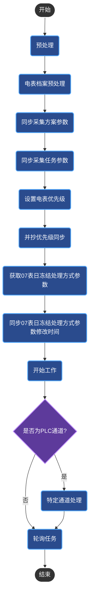
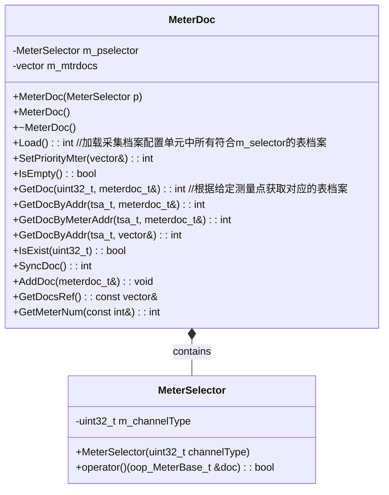

# APP介绍

`gatherexe`是用于执行下行抄表的`APP`。它主要是通过消息队列来接收其他进程发送的抄表消息来解析，并通过与本地载波模块串口或485串口来与电表进行交互。

1. `gatherexe`进程中创建了一个`dlt698_42`线程，他们之间通过`udpskt`（`UDP`套接字）来进行通信。主进程赋值监听消息队列或者检查抄表任务配置数据库来看是否有抄表任务需要执行，然后做进一步处理，通过`UDP`套接字发给线程，由线程来执行。
2. `dlt698_42`线程通过`select`函数监听来自上行的`gathexe`进程的消息和来自下行的串口消息。下行串口可以是485串口也可以是载波模块的串口。

# gatherexe启动流程

## 1.流程图



## 2.预处理

```c
static int PreProcess(int argc, char **argv)
```

1. 根据 `-t `选项传入的参数判断是执行哪个通道，`485I`还是`485II`或`plc`，从而生成不同的日志文件名。

2. 根据`LOGID_GATHEREXE`获取`OOP_LOG_CONFIG_PARAM`参数，从而获取当前`APP`对应日志ID的日志等级。

3. 如果传入的通道参数是485，则直接`return 0`；如果是`PLC`则进入步骤4。

4. 上电载波模块、载波模块复位引脚拉高，延时5秒，拉高复位引脚。

   ```c++
   /*
   *
   * 相关驱动位于bsp/SUNXI-BSP/blob/t3c-smios-test-develop/linux3.10/drivers/char/osal_devices/osal_plc_core.c
   *
   */
   int rtctrl_poweron(void); //此函数供抄表调用，用于上电载波模块
   int rtctrl_reset(void);   // 此函数供驱动库调用，用于管脚复位载波模块（软路由为杀死进程方式）
   uint32_t plc_baud(void); //获取载波模块波特率，有9600和115200，用这两种方式打开，总有一种会成功不乱码，从而确定模块波特率。
   int get_moduleinfo(int trynum); //trynum重试次数，获取模块信息。
   int open_fd(u_int32_t baud);//开启dlt698_42线程的下行抄表串口，上行与gatherexe通信的软串口（udpsocket）。
   ```

5. 根据波特率打开下行串口`fd_dnlnk`，至于是串口还是软路由，由环境变量`PLCTYPE`来决定，然后再打开上行串口（软路由）。

6. 读取模块信息状态字并设置抄表模式，设置并行抄表参数`S_OOP_METER_PARALLEL_PARAM`。

## 3.电表档案预处理

### 1.电表设备筛选

`MeterSelector` 这个类是一个**函数对象（Functor）**，**提供一个可配置的通道类型筛选器**，用于快速从电表集合中找出符合特定通信通道的设备，是电力系统数据处理中的基础组件。

### 2.表档案管理



```c++
int MeterDoc::SyncDoc(void)
{
    if ((g_cmdopt.GetChannelType() & 0xffff0000) == oop_meter_channel_t::OOP_PLC_TYPE)
    {
        sort(m_mtrdocs.begin(), m_mtrdocs.end(), less_mac);//地址由小到大排序
        vector<meterdoc_t> syncDocs(m_mtrdocs.size());
        unique_copy(m_mtrdocs.begin(), m_mtrdocs.end(), syncDocs.begin(), equal_mac);//去重
        syncDocs.erase(remove_if(syncDocs.begin(), syncDocs.end(), equal_mp_null), syncDocs.end()); //去除地址不合法的
        LOG(ERROR_L,"档案数量:%d   ,载波通信地址数量:%d\n", m_mtrdocs.size(),syncDocs.size());
        return router_sync_42(syncDocs,syncDocs);
    }
    return 0;
}
```

### 3.表档案同步

```c++
MeterDoc g_mterDocs;

static int SyncMeterdoc(int argc, char **argv)
{
    uint32_t channelType = g_cmdopt.GetChannelType();

    g_mterDocs = GetDocObjbyChannel(channelType);
    //  load the channel's	meter doc
    LOG(DEBUG_L, "Start loading meter doc\n");
    E_meterbase.SyncTime();
    if (g_mterDocs.Load() < 0)
    {
        LOG(FATAL_L, "Load meter doc failed!");
        return  -1;
    }

    LOG(DEBUG_K, "Syn the meter doc...\n");
    int res = 0;
    if ((res = g_mterDocs.SyncDoc()) < 0)
    {
        LOG(ERROR_L, "Sync the meter docs to route failed , erro res:%d , what can i do 4 u? @_@\n", res);
    }

    return 0;
}
```

**流程:**

```mermaid
graph TD
    classDef startend fill:#333,stroke:#fff,color:#fff
    classDef process fill:#1E3A8A,stroke:#4DA6FF,color:#fff
    classDef decision fill:#5D3A9B,stroke:#BB86FC,color:#fff
    classDef exit fill:#7F1D1D,stroke:#EF4444,color:#fff
    classDef loop fill:#0F766E,stroke:#06B6D4,color:#fff

    A(["开始"]):::startend --> B["初始化路由状态与暂停<br/>ResetRouteStatus(); rtctrl_pause_42()"]:::process
    B --> C["初始化变量与数组<br/>nodesnbr=0; mtr_point=NULL; 数组memset清零"]:::process

    %% 第一步：加载MAC地址并去重
    C --> D["加载MAC地址到mtr_array<br/>循环复制mtrdocs的macaddr，设置协议类型proto"]:::loop
    D --> E["排序mtr_array<br/>qsort(&mtr_array[0], ..., cmp_qsort)"]:::process
    E --> F["计算去重后MAC数量macaddrnbr<br/>循环比较相邻元素，不同则+1"]:::process
    F --> G["记录macaddrnbr日志<br/>LOG(DEBUG_K, 'macaddrnbr:%d')"]:::process

    %% 第二步：根据slavenodesinfotype处理节点
    G --> H{"是否需要下发从节点信息"}:::decision
    H -- 否 --> I["跳过节点处理流程"]:::process
    H -- 是 --> J["获取路由节点数量<br/>get_node_num_42(&nodesnbr)"]:::process

    J --> K{"获取节点数成功?"}:::decision
    K -- 否 --> L["初始化设备并退出<br/>init_device_42(INI_PARAM_INIT, 20); exit(1)"]:::exit
    K -- 是 --> M{"节点数与macaddrnbr差异>100?"}:::decision
    M -- 是 --> N["初始化设备<br/>init_device_42(INI_PARAM_INIT, 20); 节点数=0"]:::process
    M -- 否 --> O["节点数=0?"]:::decision
    N --> O

    %% 第三步：批量查询节点信息
    O -- 否 --> P["循环分批查询节点信息<br/>start从0开始，每次取5个或剩余节点"]:::loop
    P --> Q["构造查询帧并发送<br/>FrmQryNodeInfo→sndbuf_dn; dnlnk_send()"]:::process
    Q --> R["接收并解析返回帧<br/>dnlnk_recv(); FrmStruct::Parser()"]:::process
    R --> S{"解析结果正确?<br/>afn=ROUTER_GET且dt=GET_SNODE_INFO"}:::decision
    S -- 否 --> T{"重试次数<10?"}:::decision
    T -- 是 --> Q
    T -- 否 --> L
    S -- 是 --> U["提取节点MAC到mac_array<br/>循环复制frminfo.data中MAC地址"]:::process
    U --> V{"处理完所有节点?"}:::decision
    V -- 否 --> P
    V -- 是 --> W["继续下一步"]:::process

    %% 第四步：删除路由中多余节点
    W --> X["循环遍历路由节点(mac_array)"]:::loop
    X --> Y["查找节点是否在mtrdocs中<br/>bsearch(mac_array[i], mtr_array, ...)"]:::process
    Y --> Z{"找到?"}:::decision
    Z -- 是 --> AA["标记mtr_array中对应节点为已存在<br/>mtr_point->no=1"]:::process
    Z -- 否 --> AB["将MAC添加到del_array"]:::process
    AB --> AC{"del_array满5个或最后一批?"}:::decision
    AC -- 是 --> AD["删除节点<br/>del_node_42(del_array[0], idx)"]:::process
    AD --> AE{"删除成功?"}:::decision
    AE -- 否 --> L
    AE -- 是 --> AF["重置del_array索引idx=0"]:::process
    AC -- 否 --> AG["继续添加到del_array"]:::process
    AA --> AH{"遍历完所有路由节点?"}:::decision
    AF --> AH
    AG --> AH
    AH -- 否 --> X
    AH -- 是 --> AI["继续下一步"]:::process

    %% 第五步：添加路由中缺少的节点
    AI --> AJ["循环遍历mtr_array"]:::loop
    AJ --> AK{"节点未标记(no==0)?"}:::decision
    AK -- 是 --> AL["将MAC和协议添加到add_array"]:::process
    AL --> AM{"add_array满5个或最后一批?"}:::decision
    AM -- 是 --> AN["添加节点<br/>add_node_42(add_array, idx)"]:::process
    AN --> AO{"添加成功?"}:::decision
    AO -- 否 --> L
    AO -- 是 --> AP["重置add_array索引idx=0"]:::process
    AM -- 否 --> AQ["继续添加到add_array"]:::process
    AK -- 否 --> AR["跳过该节点"]:::process
    AP --> AS{"遍历完所有mtrdocs节点?"}:::decision
    AQ --> AS
    AR --> AS
    AS -- 否 --> AJ
    AS -- 是 --> AT["重新检查节点数量和信息<br/>get_node_num_42; 重复查询节点流程"]:::process

    %% 第六步：处理其他场景
    AT --> AU["记录模块文档数量<br/>get_node_num_42(&module_doc_num)"]:::process
    I --> AV{"schdmetertype == REQBYTERM或PLC_TEST_FUN?"}:::decision
    AU --> AV

    AV -- 是 --> AW["填充xc_schddocu结构<br/>复制MAC地址，初始化finished标志"]:::process
    AV -- 否 --> AX["跳过xc_schddocu处理"]:::process
    AW --> AX

    %% 第七步：根据厂商处理特定逻辑
    AX --> AY{"vender == XIAOCHEN42?"}:::decision
    AY -- 是 --> AZ["恢复路由控制<br/>rtctrl_resume_42()"]:::process
    AY -- 否 --> BA["继续"]:::process
    AZ --> BA

    BA --> BB{"vender == FRIENDCOM或JSMESH?"}:::decision
    BB -- 是 --> BC["启动组网并等待<br/>设置netstate; 循环检查组网状态; 同步netstatefile"]:::loop
    BC --> BD["组网结束或超时<br/>更新netstate.endtime; 同步文件"]:::process
    BB -- 否 --> BE["继续"]:::process
    BD --> BE

    BE --> BF{"vender == TECHREFINE?"}:::decision
    BF -- 是 --> BG["启动组网流程<br/>发送组网指令; 等待完成或超时"]:::process
    BF -- 否 --> BH["继续"]:::process
    BG --> BH

    BH --> BI{"vender == ZHONGHUIWR或JSMESH?"}:::decision
    BI -- 是 --> BJ["同步路由时间<br/>sync_routertime()"]:::process
    BI -- 否 --> BK["继续"]:::process
    BJ --> BK

    %% 第八步：并行模式处理
    BK --> BL{"g_mtr_mode == MTR_MODE_PARALLEL?"}:::decision
    BL -- 是 --> BM["同步并行电表文档<br/>parallel_mtrdoc_sync(addrdocs, vender)"]:::process
    BL -- 否 --> BN["继续"]:::process
    BM --> BN

    BN --> BO(["返回0"]):::startend

    linkStyle default stroke:#FFFFFF,stroke-width:1px
```




# 定时抄表

## 1.实际激活时间计算

### 1.时间取整的本质

时间取整（Time Truncation/Rounding）是将时间值舍入到指定时间单位的整数倍的操作，目的是让时间对齐到特定的间隔或边界。这在任务调度、数据统计、定时执行等场景中非常常见。

时间取整的本质是**将时间值调整为指定单位的整数倍**，忽略更小单位的精度。例如：

- **秒级取整**：将时间对齐到最近的整秒（如 `17:25:30` → `17:25:30`）。
  **示例**：`Interval = 30` 秒，当前时间 `17:25:30` → 取整后 `17:25:30`（因 30 是 30 的整数倍）。
- **分钟级取整**：将时间对齐到最近的整分钟（如 `17:25:30` → `17:25:00`）。
  **示例**：`Interval = 15` 分钟，当前时间 `17:25:30` → 取整后 `17:15:00`（忽略秒，分钟对齐到 15 的倍数）。
- **小时级取整**：将时间对齐到最近的整小时（如 `17:25:30` → `17:00:00`）。
  **示例**：`Interval = 3` 小时，任务开始时间 `20:30:00` → 取整后 `18:30:00`（小时向前调整到最近的 3 的倍数，分钟保留 30）。

### 2.为什么需要时间取整

1. **周期性任务调度**：确保任务按固定间隔执行（如每 15 分钟、每 3 小时）。
2. **数据聚合**：将时间序列数据按小时、天、月分组统计（如计算每小时的平均请求数）。
3. **资源优化**：避免系统在非整点时间执行任务，减少调度开销。
4. **用户体验**：在界面上显示更友好的时间（如将 `14:42:15` 显示为 `14:45`）。

## 2.定抄中的时间取整

### 1.任务开始时间在当前时间之后（将来）

假设：

- **当前时间** `now = 2025-07-22 17:25:30`
- **任务开始时间** `task.StartTime = 2025-07-22 20:30:00`（3 小时 15 分钟后）
- **实际启动时间** `minstart = task.StartTime`（直接使用任务设定的未来时间）

各间隔类型计算结果:

| 间隔类型 | Interval 值 | 计算逻辑                         | 实际执行时间                                    |
| -------- | ----------- | -------------------------------- | ----------------------------------------------- |
| SECOND   | 30          | 秒数对齐到 30 的倍数             | `2025-07-22 20:30:00`（秒数 0 已是 30 的倍数）  |
| MINUTE   | 15          | 分钟对齐到 15 的倍数             | `2025-07-22 20:30:00`（分钟 30 已是 15 的倍数） |
| HOUR     | 3           | 小时对齐到 3 的倍数，分钟保持 30 | `2025-07-22 18:30:00`（`20:30 → 18:30`）        |
| DAY      | 1           | 日期不变，时间保持 `20:30:00`    | `2025-07-22 20:30:00`                           |
| MONTH    | 1           | 月份不变，日期和时间保持         | `2025-07-22 20:30:00`                           |

### 2.任务开始时间在当前时间之前（过去）

假设：

- 当前时间 `now = 2025-07-22 17:25:30`
- 任务开始时间 `task.StartTime = 2025-07-22 10:30:00`（6 小时 55 分钟前）
- **实际启动时间 `minstart = now`**（任务已过期，使用当前时间并对齐到最近间隔）

各间隔类型计算结果:

| 间隔类型 | Interval 值 | 计算逻辑                           | 实际执行时间                                         |
| -------- | ----------- | ---------------------------------- | ---------------------------------------------------- |
| SECOND   | 30          | 秒数对齐到 30 的倍数               | `2025-07-22 17:25:30`（秒数 30 已是 30 的倍数）      |
| MINUTE   | 15          | 分钟对齐到 15 的倍数               | `2025-07-22 17:15:00`（`当前 17:25 → 向前取 17:15`） |
| HOUR     | 3           | 小时对齐到 3 的倍数，分钟保持 30   | `2025-07-22 15:30:00`（`当前 17:25 → 向前取 15:30`） |
| DAY      | 1           | 月份日期不变，时间对齐到`10:30:00` | `2025-07-22 10:30:00`（直接使用任务设定时间）        |
| MONTH    | 1           | 月份不变，日期和时间对齐到任务设定 | `2025-07-22 10:30:00`（直接使用任务设定时间）        |

### 3.总结

间隔类型是啥，任务的实际开始时间的自身及其之前的时间保持不变，其余的部分为任务的开始执行时间的保持一致，然后整个时间开始时间再对该间隔类型取整。

如：间隔类型为小时，则任务的实际**激活**执行（真正执行时间）时间的**年月日时**就为前面计算出的任务实际开始时间（虚假的真正执行时间）的**年月日时**，而分为任务配置里的**任务开始时间**的分保持一致且**秒为0**，然后整个**激活执行时间**再给小时取整。

## 3.时间延时

在集中器抄表场景中，将抄表时间从电表的分钟冻结时间（`如 18:30:00`）延迟 2 分钟至` 18:32:00`，主要是为了确保抄表数据的准确性、完整性和抄表过程的稳定性，具体原因可从以下几个方面分析：

### 1. 等待电表完成 冻结数据”的生成与存储

电表的 “分钟冻结时间” 是指电表在特定分钟（如 `18:30`）自动记录并保存当前计量数据（如用电量、电压、电流等）的时间点。但这个 “冻结” 过程并非瞬时完成：

- 电表内部需要对实时数据进行采样、校验、写入存储（如 `EEPROM`），这个过程可能需要几秒到几十秒（具体取决于电表硬件性能和数据量）。
- 如果集中器在` 18:30:00 `立即发起抄表，可能遇到电表尚未完成数据冻结的情况，导致抄回的数据不完整（如部分字段为空）或为冻结前的临时数据，影响准确性。
- 延迟 2 分钟可以确保电表有充足时间完成冻结数据的生成和存储，此时抄表能获取到完整、有效的冻结数据。

### 2. 规避通信信道的瞬时拥堵

集中器与电表之间的通信（如电力线载波、微功率无线、`RS485` 等）可能存在 “冻结时间点” 的信道拥堵：

- 若多个集中器或同一集中器下的多块电表在同一冻结时间点（如 `18:30`）同时发起数据交互，可能导致通信信道负载骤增，出现信号冲突、丢包等问题。
- 延迟 2 分钟后，大部分即时通信需求已消退，信道相对空闲，能提高抄表指令的传输成功率，减少重传次数，提升抄表效率。

### 3. 兼容电表的 数据读取权限或协议限制

部分电表的通信协议可能对冻结数据的读取有 “时间窗口” 限制：

- 某些电表规定，冻结数据生成后需等待一定时间（如 1-2 分钟）才允许外部设备读取（可能是为了避免数据被并发读写导致的一致性问题）。
- 若集中器在冻结时间点立即读取，可能触发电表的协议保护机制，返回 “数据未就绪” 或 “权限不足” 的响应，导致抄表失败。延迟 2 分钟可避开这个限制窗口。

### 4. 应对集中器与电表的时间同步偏差

尽管集中器和电表会通过校时机制保持时间同步，但实际运行中可能存在微小的时间偏差（如几秒到 1 分钟）：

- 若电表的实际冻结时间因偏差晚于集中器的本地时间（如集中器显示` 18:30` 时，电表实际是 18:29:50），此时集中器立即抄表会错过冻结点。
- 延迟 2 分钟可以覆盖这种时间偏差，确保无论双方时间如何微小错位，都能落在电表冻结数据已生成的时间范围内。

### 5.总结

延迟 2 分钟的核心目的是 **“等待数据就绪、规避通信风险、兼容设备特性”**，最终保障抄表数据的准确性和抄表过程的可靠性。这是抄表系统在长期实践中形成的工程经验 —— 通过短暂的时间代价，换取数据质量和系统稳定性的提升。

## 4.`gathremng`

1. **导入485端口功能**
   读取485端口功能参数,保存到` g_rs485stats`

   ```c++
   typedef struct //OOP_RS485_PORT_PARAM
   {                                
       char rs485Descriptor[100];   //rs485设备描述符
       comdcb_t rs485comdcb;       //端口参数
       uint8_t rs485function;      //rs485端口功能: 上行通信（0），抄表（1），级联（2），停用（3）
   } __attribute__((packed)) S_OOP_RS485_PORT;
   ```

   ```c++
   
   CParam param;
   for(int rs485Index=0; rs485Index < 3; rs485Index++)
   {
       S_OOP_RS485_PORT rs485Param;
       memset(&rs485Param, 0, sizeof(S_OOP_RS485_PORT));
       if (!param.GetTypeParam((unsigned char *)&rs485Param, &len, OOP_RS485_PORT_PARAM,  rs485Index+1))
       {
           g_rs485stats[0xf2010201+rs485Index] = 1;
           printf("rs485param%d get error\n", rs485Index+1);
       }
       else
       {
           g_rs485stats[0xf2010201+rs485Index] = rs485Param.rs485function;
       }
   }
   ```

2. **导入表档案并打印档案内容信息**

   ```c++
   int LoadMeter(vector<oop_MeterBase_t>  &mdoc_vecs)
   ```

3. **导入采集方案并打印内容信息**

   ```c++
       LoadNormalGather();//读取6014 普通采集方案g_gather, 交采普通采集方案g_gatheracs
       LoadEvtGather();//读取6016 事件采集方案g_evnt_gather
       LoadTransGather();
   ```

4. **导入方案的任务**

   ```c++
   CParam param;
   oop_task_t task;
   memset(&task, 0, sizeof(task));
   int len = sizeof(task);
   bool bGetSuccess = param.GetFirstParam(&task, &len, OOP_TASK_PARAM);
   ...
   ...
   ```

5. **实现观察者模式，加入观察者队列**
   利用观察者模式来实现任务的调度，被观察者检查当前时间是否大于所有需要调度的任务的其中一个的下次执行时间，然后通知观察者，调用观察者更新接口，执行当前任务再更新下一次执行时间。

6. **监控系统时间变化**
   监控系统时间的变化，一旦检测到时间出现大幅跳跃（回退超过 5 分钟或前进超过预设阈值），就会执行清理操作并退出程序。当系统时间被手动调整回退时，可能会导致基于时间戳的数据出现混乱，因此要删除旧的数据库文件可以避免新旧数据时间戳不一致的问题

   ```c++
   time_t lsttime = time(NULL);
   time_t last = time(NULL);//获取当前系统时间并存储在lsttime和last变量中
   
   for(;;)
   {
       //lsttime - time(NULL) > (5 * 60) 检测时间是否回退超过 5 分钟（300 秒）
       //time(NULL) - lsttime > (MAXTIMEDIFF) 检测时间是否前进超过预设阈值
       if (lsttime - time(NULL) > (5 * 60) || time(NULL) - lsttime > (MAXTIMEDIFF))
       {
           LOG(ERROR_L, "lsttime is %d,curtime is %d\ntime roll back or forward exceeds %d minute > %dminute ,exit\n",
               lsttime, time(NULL), (time(NULL) - lsttime) / 60, MAXTIMEDIFF / 60);
           if (lsttime - time(NULL) > (5 * 60))
           {
               LOG(ERROR_L, "roll backexceeds;rm -rf  /mtdpart0/record_*.db \n");
               system("rm -rf  /mtdpart0/record_*.db");
           }
           g_objLog.fflush();
           sleep(5); // 时间修改后休眠5秒再退出，以保证时间稳定
           exit(1);
       }
       else
       {
           lsttime = time(NULL);//如果时间正常，则更新lsttime为当前时间
       }
   }
   ```

7. **读模块信息**
    I型集中器需要`gatherexe`读载波模块版本号,确认`HPLC`模块,是否使用并发抄表,决定是否拆分OAD。

8. **任务调度**

9. 判断是否有新实列需要插入。

------

# 并发抄表

## 1.文件位置

```c++
parallel_unify42.h
parallel_unify42.cpp
```


## 1.抄表数据结构

```c++
class GatherData
{
public:
    GatherData();
    virtual ~GatherData();
    GatherData(const GatherData&) = delete;
    GatherData(GatherData&&) = delete;
    GatherData& operator=(const GatherData&) = delete;
    GatherData& operator=(GatherData&&) = delete;
    void SetBuffer(uint8_t *buf,size_t len);
    CGXByteBuffer &GetBuffer();
    void SetAddr(uint8_t addr[]);
    void GetAddr(uint8_t addr[]);
    void SetSeq(uint8_t seq);
    uint8_t GetSeq();
    void SetRxPort(uint8_t port);
    uint8_t GetRxPort();
public: 
    CGXByteBuffer m_buffer;
    uint8_t m_addr[6];
    uint8_t m_seq;
    uint8_t m_RxPort;
};
```


# 通信模块的通信方式

通信方式是指集中器下行的通信模块所采用的通信方式类型，不同的通信方式决定用户数据区中的

数据构成和格式，主要有下面这些通信方式：

```c++
typedef enum {
    RESERVED			=	0x00,//保留
    CENTRALIZED			=	0x01,//集中式路由载波通信
    DISTRIBUTED			=	0x02,//分布式路由载波通信
    BROADBAND			=	0x03,//HPLC 载波通信
    ESROUTER            =   0x07,//窄带PLC主从式(东软载波)
    WIRELESS			=	0x0a,//微功率无线通信
    ETHERNET			=	0x14//以太网通信
} com_t;
```

# 进程、线程、载波模块间的通信

## 1.文件位置

```shell
#(软路由通信)
/sg698/gathermeter/unify42/udpskt.h
/sg698/gathermeter/unify42/udpskt.cpp

#（串口通信）
/sg698/gathermeter/unify42/amrserial.h
/sg698/gathermeter/unify42/amrserial.cpp
```

## 2.通信方式介绍

```c++
typedef enum {
	UDPSKT_DNLNK = 0,//线程到本地模块(宽带载波不是用UDP)
	UDPSKT_UPLNK, //线程接收进程，并发到进程（线程调用）
	UDPSKT_EXTLNK, //进程接收线程，并发到线程（进程调用）
	UDPSKT_NBR,
} udpskt_type_t;
```

- `gatherexe`进程到`dlt698_42`线程

  ```c++
  UDPSKT_EXTLNK, //进程发到线程（UPD套接字）
  ```

- `dlt698_42`线程到`gatherexe`进程

  ```c++
  UDPSKT_UPLNK, //线程发到进程（UPD套接字）
  ```

- `dlt698_42`线程到本地模块

  ```c++
  if(模块类型 ==  软路由)
      UDPSKT_DNLNK = 0,//线程到本地模块(宽带载波不是用UDP)
  else if(模块类型 == 载波)
      串口通信
  
      //！！！模块类型是软路由还是载波，由集中器环境变量PLCTYPE来设置
  modtype     = CARRIer;
  es_type			=	ES_STANDARD;
  char *type = getenv("PLCTYPE");
  if (type != NULL)
  {
      if (strcmp(type, "unify42") == 0)
      {
          modtype     = CARRIer;
          es_type			=	ES_STANDARD;
      }
      else if (strcmp(type, "eastsoftCOMP") == 0) // 为东软三代兼容模式
      {
          modtype     = CARRIer;
          es_type			=	ES_COMPATIBLE;
      }
      else if (strcmp(type, "eastsoftExt") == 0) // 为东软过零检测模式
      {
          modtype     = CARRIer;
          es_type			=	ES_ZEROTEST;
      }
      else
      {
          modtype 		=	SOFTROUTER;
      }
  }
  ```

# `pub`

## 1.`CGuageFile`（进度数据库）

可以理解为，此文件存的是实列调度状态的实时状态文件，调度程序每次在启动时需要读取数据库的调度状态表获取需要调度执行的任务数据，然后依次执行。

